# Home Cinema Control Installation And Setup

[Español](INSTALL.md) · [README](README.en.md)

This guide covers Docker deployment and the HCC web setup flow. It focuses on the problems that usually make
Emby/Jellyfin/NAS/OPPO/TV/AV installations hard to debug: path mapping, IP discovery, NFS/SMB mounts, CEC/ARC
interference, and raw logs without context.

For NAS-specific screenshots and OPPO/Chinoppo player preparation, use the AVPasion Xnoppo community tutorial as an
external reference:

https://foro.avpasion.com/t/xnoppo-lo-mejor-de-emby-en-tu-oppo-203-205-y-chinoppo-clones-m9702-m9201-m9203-m9205.2779/page-21#post-73867

Use that guide for NAS permissions, shares, and player-side setup. Use this guide for HCC.

## 1. Before You Start

| Requirement                | Notes                                                     |
|----------------------------|-----------------------------------------------------------|
| Docker                     | Linux recommended. Host networking is required.           |
| Emby or Jellyfin           | Either one, reachable from HCC.                           |
| OPPO/Chinoppo player       | Must expose the OPPO MediaControl API.                    |
| NAS or shared media folder | Must be visible to both your media server and the player. |
| NFS or SMB/CIFS            | Selected per path mapping in HCC.                         |
| TV and AV receiver         | Optional. HCC can run without them.                       |

Recommendations:

- Reserve fixed IPs for your media server, NAS, player, TV, and AV receiver.
- Create the libraries in Emby or Jellyfin first. HCC does not invent libraries; it reads the ones already configured
  on your server. For Emby, see [Library Setup](https://emby.media/support/articles/Library-Setup.html) and
  [Quick Start](https://emby.media/support/articles/Quick-Start.html). For Jellyfin, see
  [Adding Media Libraries](https://jellyfin.org/docs/general/server/libraries/).
- Share the NAS folders through NFS or SMB/CIFS and confirm the player can browse them from its own network browser.
- Decide which libraries HCC should intercept.
- If your AV receiver switches back to TV Audio after HCC selects the player input, review HDMI CEC/ARC. In some setups,
  disabling CEC/ARC on the AVR is the stable fix.

## 2. Quick Start With Docker

You can start HCC directly with `docker run`:

```bash
docker volume create home-cinema-control-config

docker run -d \
  --name home-cinema-control \
  --network host \
  --cap-add NET_RAW \
  --restart unless-stopped \
  -e TZ=Europe/Madrid \
  -e PYTHONUNBUFFERED=1 \
  -e HCC_CONFIG_FILE=/config/config.json \
  -e HCC_SECRETS_FILE_PATH=/config/secrets.json \
  -v home-cinema-control-config:/config \
  ghcr.io/tousled/home-cinema-control:latest
```

Open `http://<your-host>:8090`.

Host networking is required so HCC can reach Emby, the player, TV, AVR, and network discovery tools directly.

## 3. Recommended Install With Docker Compose

For long-running installs, create `compose.yaml`. It is easier to update, pin to a specific version, or roll back:

```yaml
services:
  home-cinema-control:
    image: ghcr.io/tousled/home-cinema-control:latest
    container_name: home-cinema-control
    network_mode: host
    cap_add:
      - NET_RAW
    restart: unless-stopped
    environment:
      TZ: Europe/Madrid
      PYTHONUNBUFFERED: "1"
      HCC_CONFIG_FILE: /config/config.json
      HCC_SECRETS_FILE_PATH: /config/secrets.json
    volumes:
      - home-cinema-control-config:/config

volumes:
  home-cinema-control-config:
    name: home-cinema-control-config
```

Start it:

```bash
docker compose pull
docker compose up -d
```

Open `http://<your-host>:8090`.

`network_mode: host` is required: HCC talks directly to Emby/Jellyfin, the OPPO/Chinoppo, TV, AVR, and discovery
tools like `arp-scan`.

### 3.1 Installing with Portainer or another web UI

In Portainer: **Stacks → Add stack**, then paste the `compose.yaml` above.

To pin a specific version (release candidates included), add `HCC_VERSION` as a stack environment variable, e.g.
`HCC_VERSION=1.1.0-rc.2`. That's the only thing that decides which image gets pulled — without it, Portainer uses
`latest` (the latest stable release). To update, change that value and redeploy by re-pulling the image, not by
rebuilding from the Dockerfile.

Other web UIs (Synology Container Manager, Unraid, etc.) should work the same way if they let you set environment
variables for the stack — same logic applies.

## 4. Migration Or Fresh Setup

If HCC finds a compatible older configuration, it shows a migration screen.

<p align="center">
  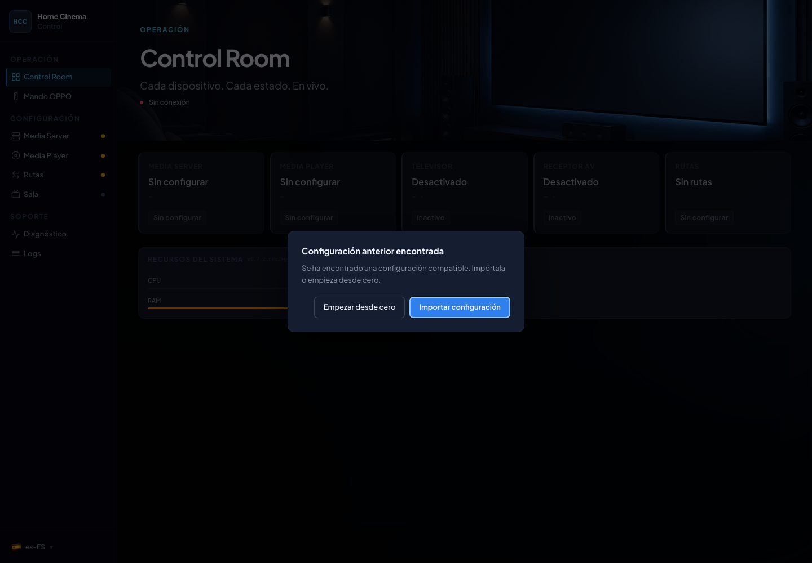
</p>

HCC now saves setup by section and keeps secrets in `/config/secrets.json`.

If this is instead a brand-new install (no prior HCC configuration) and you're coming from the predecessor
XNOPPO/Chinoppo project, HCC offers a second, separate prompt: import your old XNOPPO `config.json` instead of
setting everything up from scratch. Pick the file, and HCC migrates OPPO/TV/AV/paths the same way the regular
migration does, moves your Emby server URL into the new config shape, and — if the server is reachable at that
moment — logs in with the old file's username/password to obtain a real token. If it can't reach the server, the
provider is still added but left unauthenticated, and the Media Server sidebar indicator turns orange so you know to
finish connecting it from its own screen. If you don't have an XNOPPO `config.json`, or would rather not import it,
choose "Configure from scratch" and follow the normal wizard.

<!-- TODO: screenshot of the XNOPPO import modal on a fresh install -->

## 5. Media Server: Emby or Jellyfin

Pick the provider (Emby or Jellyfin), then configure its URL, authentication, and the client/device HCC should
monitor. Screenshots in this guide show Emby, but the flow is the same with Jellyfin.

<p align="center">
  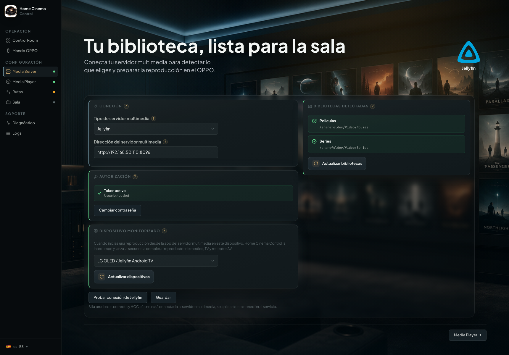
</p>

The page header shows the selected provider logo, for example Emby or Jellyfin, so you can immediately recognize which
integration you are configuring. The logo is muted while the provider still needs authorization or connection setup, and
becomes more prominent once that provider is authorized. The server URL, user, and detailed readiness information stay
in
the configuration panels instead of being repeated in the header.

<p align="center">
  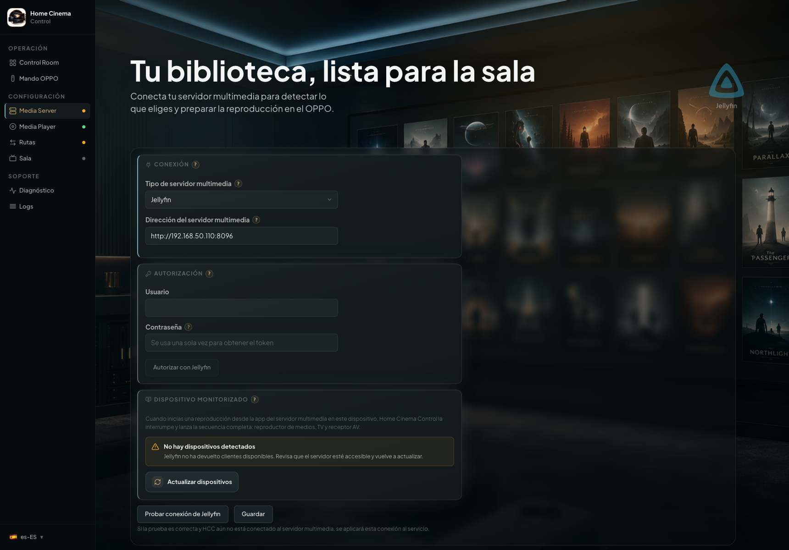
</p>

This screen avoids manual token editing, reloads the media server's devices, and prepares library discovery for path
mapping.

If you use Jellyfin, the account you authorize HCC with must be an **administrator** for device and library reload
to work — see [Frequent Issues](#14-frequent-issues).

## 6. Media Player

Configure the OPPO/Chinoppo IP address and test the MediaControl API.

<p align="center">
  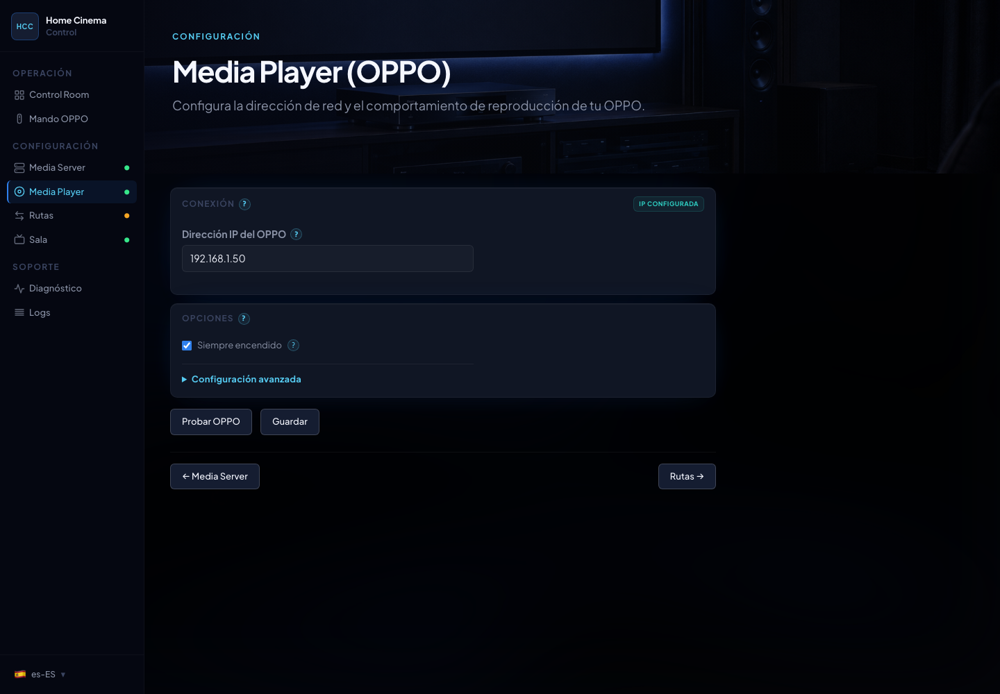
</p>

When `arp-scan` is available inside the container, HCC shows **Scan network** and suggests detected LAN IP addresses
under the IP field.

<p align="center">
  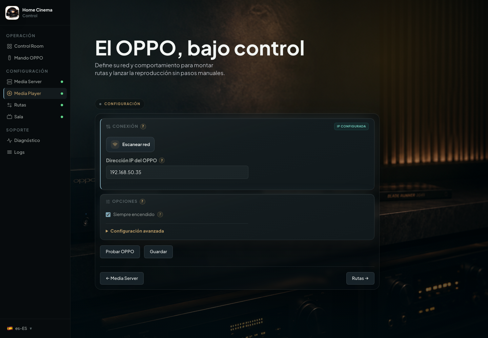
</p>

The search filters by IP, name, or vendor when that information is available. To search by names like `oppo`, `lg`, or
`denon`, configure device names, DHCP reservations, or local DNS in your router. If your network does not return names,
you can still search or type the IP address directly.

## 7. Media Paths: The Important Part

This is the critical setup step because it solves the real problem: Emby knows where the movie lives on the server, but
the OPPO/Chinoppo needs to reach that same movie as a NAS network share.

Think of HCC as a path translator:

```text
Emby sees:        /volume1/Video/Movies/Dune (2021).mkv
OPPO over NFS:    volume1/Video/Movies/Dune (2021).mkv
OPPO over SMB:    Video/Movies/Dune (2021).mkv
HCC saves:        this library uses this OPPO path and this protocol
```

Do not guess these paths. NAS vendors, NFS, and SMB do not always expose the same names. HCC starts from the active
provider's libraries, asks for the equivalent player-visible path, and tests it before a real viewing session. The
screen shows an Emby/Jellyfin badge so you can tell which server you are mapping.

<p align="center">
  
</p>

### 6.1 Create Emby Libraries First

Before opening HCC, Emby should already have scanned libraries: Movies, TV Shows, Concerts, or whatever you use. In
Emby,
a library groups one or more physical folders. HCC detects those libraries and paths, but it does not create the library
for you.

Typical Emby path:

```text
Emby Dashboard -> Library -> Add Media Library
```

Emby's official [Library Setup](https://emby.media/support/articles/Library-Setup.html) covers this step. Its
[Quick Start](https://emby.media/support/articles/Quick-Start.html) also recommends separating media by type, such as
Movies, TV Shows, or Music.

When done, go to HCC and use **Reload libraries** in Media Paths. If a library does not appear, fix Emby first instead
of typing paths blindly.

### 6.2 Choose Which Libraries HCC Should Intercept

Not everything in Emby has to go through the OPPO. You can leave music, documentaries, tests, or lightweight libraries
on the normal Emby playback path.

The screen shows detected libraries and lets you enable only the ones you want HCC to control. The rest keep playing
through the normal Emby flow.

<p align="center">
  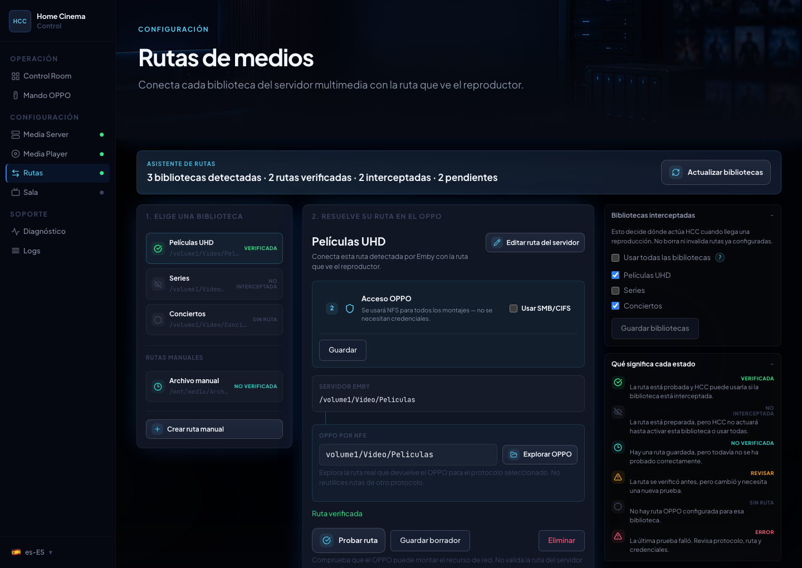
</p>

### 6.3 Prepare NFS Or SMB/CIFS On The NAS

HCC does not configure NAS permissions. The OPPO/Chinoppo must be able to browse the share from its own network menu.

For NFS:

- enable NFS on the NAS;
- export the media folder;
- allow access from the player IP;
- check read permissions;
- confirm from the OPPO that the share appears and you can browse to the library folder.

For SMB/CIFS:

- enable SMB on the NAS;
- share the media folder;
- create or choose a user with read permission;
- save username and password in HCC if the share is not guest-accessible;
- confirm from the OPPO that you can browse to the folder.

When you use SMB/CIFS, HCC keeps credentials in the same Media Paths screen so you do not have to jump between screens
or edit files.

<p align="center">
  
</p>

For Synology, QNAP, Windows, Unraid, or M9702/M920x screenshots, use the AVPasion thread linked at the top of this
guide. HCC documents the HCC side; the exact NAS setup depends on your platform.

### 6.4 Find The Path As The OPPO Sees It

This step prevents most failures. Do not copy only the Emby path. Open the OPPO/Chinoppo network browser and note how
the folder appears there.

Common examples:

| Emby may see            | OPPO may see                |
|-------------------------|-----------------------------|
| `/volume1/Video/Movies` | NFS: `volume1/Video/Movies` |
| `/volume1/Video/Movies` | SMB: `Video/Movies`         |
| `/mnt/media/Movies`     | SMB: `NAS/Movies`           |
| `D:\Movies` on Windows  | SMB: `Server/Movies`        |

If you are unsure whether to use NFS or SMB, start with the protocol that already works manually from the player. You
can
add another mapping with another protocol later if a specific library needs it.

### 6.5 Create And Test The Mapping In HCC

In **Media Paths**, work library by library:

1. Click **Reload libraries** to load the current Emby libraries.
2. Select the library you want HCC to intercept.
3. Review the **server path** HCC read from Emby.
4. Choose `nfs` or `cifs` for that library.
5. Enter or select the **OPPO path** exactly as the player sees it.
6. If you use SMB with a user, fill in SMB credentials.
7. Click **Test path**.
8. Save when the route is verified.

<p align="center">
  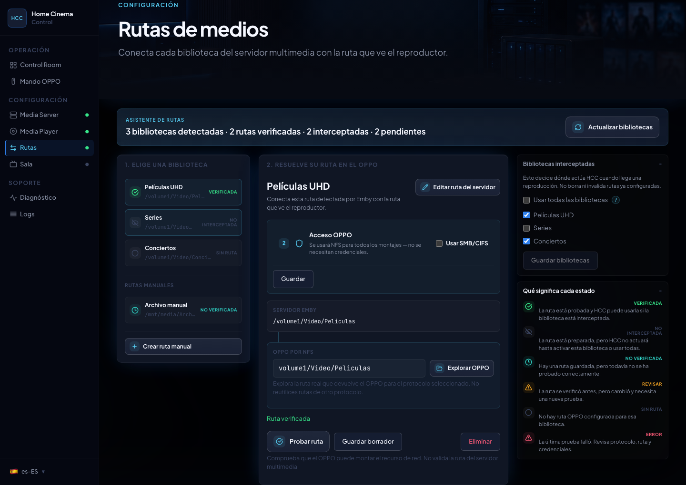
</p>

State meanings:

| State    | What to do                                                                    |
|----------|-------------------------------------------------------------------------------|
| Verified | The player mounted this route successfully.                                   |
| Pending  | Something changed and the route needs another test.                           |
| Review   | The mapping exists, but related setup changed. Test again.                    |
| Error    | HCC could not mount the route. Read the suggestion and filter logs by errors. |

<p align="center">
  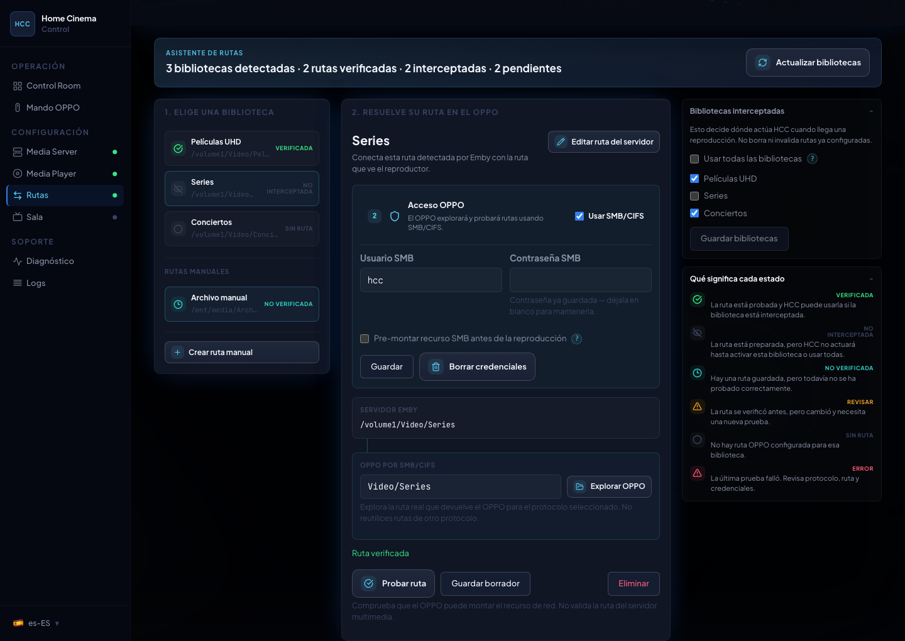
</p>

### 6.6 When To Use Manual Mode

Manual mode exists for real edge cases, not as a return to the old workflow:

- Emby does not return the expected folder;
- a library combines multiple physical folders;
- the NAS exposes different names through NFS and SMB;
- you want a test route before touching the main library;
- you are migrating from an older setup and want to review each mapping.

The important improvement is that manual mode is no longer “type something and hope”: you can test the mount, read the
diagnostic, and save only when you know which route works.

<p align="center">
  
</p>

### 6.7 What HCC Improves Here

HCC can discover Emby libraries, choose intercepted libraries, configure NFS or SMB/CIFS per mapping, test the player
mount, and fall back to manual mapping when needed.

HCC does not silently switch protocols. If a mapping is SMB, playback uses SMB. If it is NFS, playback uses NFS.

### 6.8 Why This Step Improves Playback

Once routes are verified, HCC can treat playback as a controlled flow instead of a chain of guesses:

- mount the correct share directly on the OPPO/Chinoppo;
- avoid retries with protocols you did not choose;
- classify the failure if the mount fails;
- observe player state through SVM3 when available;
- use bounded polling as a fallback, not as the only permanent strategy;
- report progress to Emby on a controlled cadence;
- clean up the session after stop or natural end so the player is not left in an odd state.

The difference is not always visible on screen, but it matters: less noise toward the player, fewer random behaviours,
and better information when something fails.

## 8. Room Setup

TV and AV receiver control are optional and configured separately.

<p align="center">
  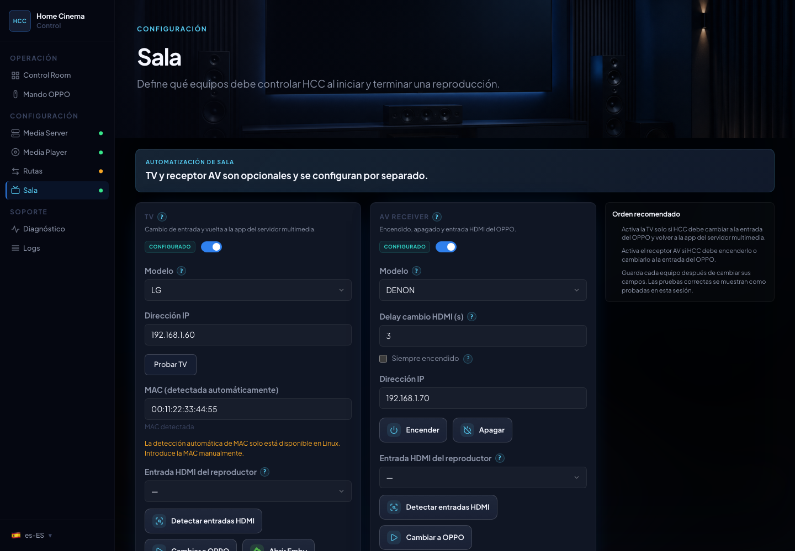
</p>

The same network scan helps locate the TV and AV receiver when you configure **Room Setup**.

<p align="center">
  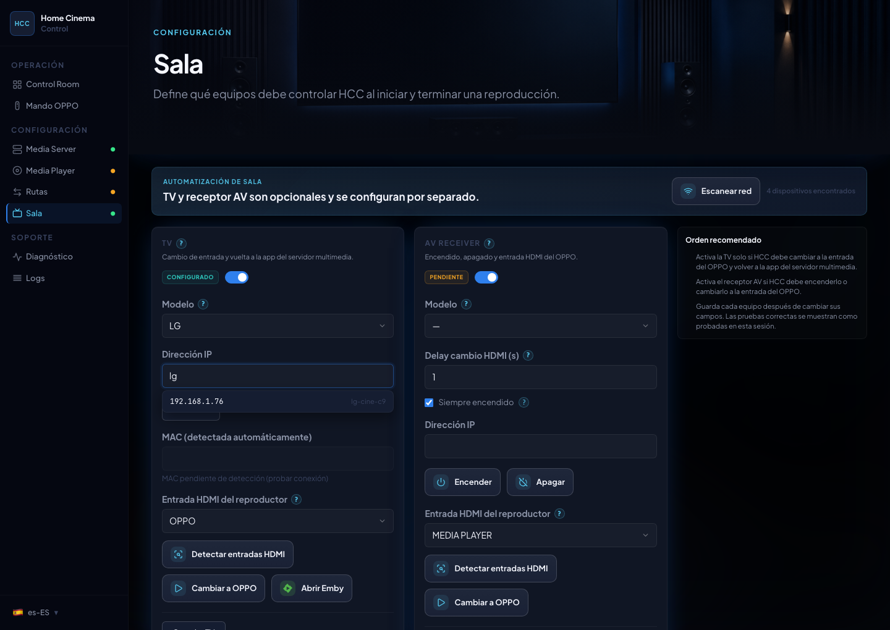
</p>

If TV or AV is disabled, HCC does not include it in the playback flow. If CEC/ARC forces the receiver back to TV Audio,
disable CEC/ARC on the AVR or adjust HDMI settings before relying on automation.

## 9. Diagnostics

The Status screen shows readiness, playback state, latest failure, version status, and support summary.

<p align="center">
  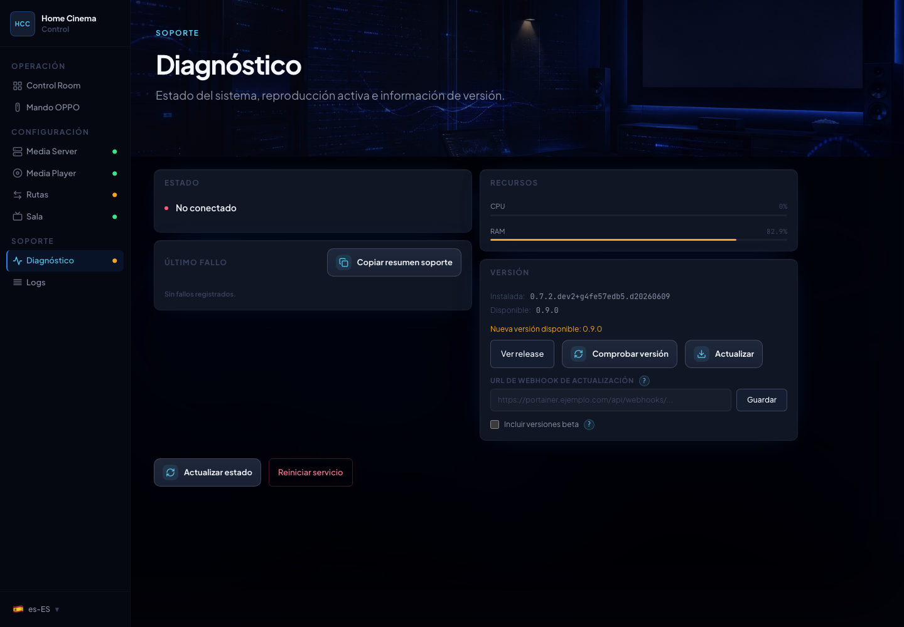
</p>

Use it to understand whether the issue is Emby, path mapping, OPPO mount, optional room control, or deployment/update.

## 10. Readable Logs

The Logs screen renders structured logs with severity and filtering.

<p align="center">
  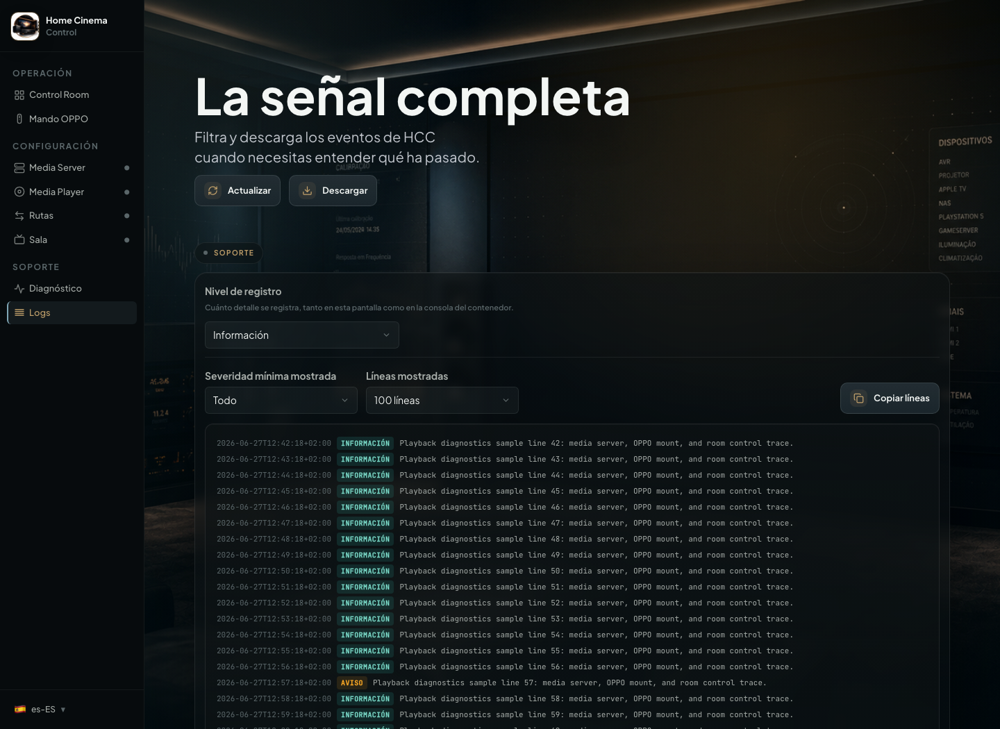
</p>

This makes support easier than sharing raw unfiltered logs.

## 11. First Playback Validation

Once the setup screens are saved and verified, test one movie from an intercepted library. Do not only check that the
player starts; check the full cycle.

| Test                                | What it confirms                                                  |
|-------------------------------------|-------------------------------------------------------------------|
| Play from the monitored Emby client | HCC intercepts only the intended device.                          |
| Selected NFS/SMB mount              | The library uses the configured protocol without silent fallback. |
| Pause and resume                    | Emby and OPPO do not drift into different states.                 |
| Seek from Emby                      | The player responds to basic interactive commands.                |
| Audio/subtitle changes              | Track selection is not mapped through the wrong indexes.          |
| Stop and natural end                | Emby keeps watched/resume state and HCC cleans up the session.    |
| Return to app or expected input     | TV/AV finish in the expected state when configured.               |
| Intentional failure check           | The latest failure shows component, reason, and next action.      |

Real hardware validation still matters: original OPPO players, Chinoppo clones, firmware, NAS, TV, and AVR combinations
can behave differently. If something fails, copy the support summary from **Diagnostics** and filter logs by warnings or
errors.

## 12. NAS And Player Preparation

HCC does not change NAS permissions or player settings. Before testing paths:

- the NAS must expose the folder via NFS or SMB/CIFS;
- the player must see that share in its own network browser;
- SMB users should verify username, password, and NAS SMB compatibility;
- NFS users should verify export permissions for the player IP.

Use the AVPasion thread linked above for platform-specific screenshots.

## 13. Updating

If you installed with Docker Compose:

```bash
docker compose pull
docker compose up -d
```

If you installed with `docker run`:

```bash
docker pull ghcr.io/tousled/home-cinema-control:latest
docker stop home-cinema-control
docker rm home-cinema-control

docker run -d \
  --name home-cinema-control \
  --network host \
  --cap-add NET_RAW \
  --restart unless-stopped \
  -e TZ=Europe/Madrid \
  -e PYTHONUNBUFFERED=1 \
  -e HCC_CONFIG_FILE=/config/config.json \
  -e HCC_SECRETS_FILE_PATH=/config/secrets.json \
  -v home-cinema-control-config:/config \
  ghcr.io/tousled/home-cinema-control:latest
```

If you installed with Portainer or another web UI: change the stack's `HCC_VERSION` environment variable to the
version you want and redeploy by re-pulling the image, not by rebuilding from the Dockerfile — see
[3.1](#31-installing-with-portainer-or-another-web-ui).

If configured, the Status screen can call a redeploy webhook. Otherwise it shows the manual command.

## 14. Frequent Issues

### Jellyfin: devices and libraries don't show up when you click "Reload"

- The Jellyfin account you authorize HCC with must be an **administrator**. Jellyfin restricts the device list
  (`/Devices`) and the library/virtual-folder list (`/Library/VirtualFolders`) to elevated accounts — a regular
  account gets a 403 error loading them, even though login itself (authorizing, playing, reporting progress) works
  normally.
- If you only have one Jellyfin user, it's almost certainly already the administrator and there's nothing to change.
  If HCC uses a secondary account, grant it administrator rights from the Jellyfin dashboard.

### HCC cannot reach the player

- Check the OPPO/Chinoppo IP address.
- Check `network_mode: host`.
- Check firewall rules.
- Wake the player and test again.

### NFS mount fails

- Verify that the NFS export exists.
- Confirm the player can browse it manually.
- Physically restart the player if its browser works but the mount remains stuck.

### SMB returns `id_error`

- Check share name, username, password, and permissions.
- Try SMB pre-mount if your NAS/player combination needs session preparation.
- Do not expect fallback to NFS: fix SMB or explicitly change that mapping to NFS.

### SMB times out on long folder names or names with special characters

Some OPPO/Chinoppo players time out mounting an SMB folder whose name is very long or includes
parentheses, brackets, or a `+` sign (common in release-style names for movies and TV episodes, e.g.
`The Veil red de mentiras (2024) S01 [PACK][DSNP WEB-DL 1080p AVC ES DD+ 5.1][HDO]`). The same content,
in the same NAS folder, mounts and plays fine over NFS, and over SMB too once the folder/file name is
shortened or simplified. If one specific library keeps timing out over SMB while your other SMB
libraries work fine, suspect the name length/characters first, before checking the network or the NAS:

- Switch that specific mapping to NFS if your NAS exposes it (the fastest way to keep watching that
  content).
- Or rename the folder/file to something shorter without parentheses/brackets if you want to keep
  using SMB.

### The AVR changes input by itself

- Review CEC/ARC.
- Disable CEC/ARC on the AVR if it forces TV Audio.
- Increase HDMI switch delay if the receiver needs more time after standby.
