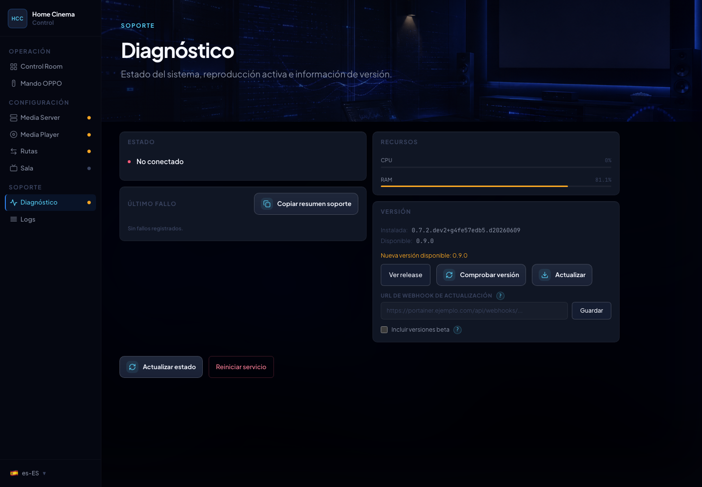
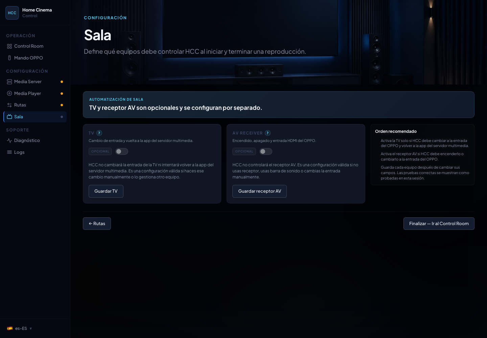

<div align="center">
  

<h3>La experiencia integrada para Emby, OPPO/Chinoppo y tu sala de cine.</h3>

  <p>
    HCC convierte un <strong>Play</strong> en Emby en una secuencia completa:
    ruta correcta, montaje en el reproductor, cambio de entradas, control de sala y seguimiento de progreso.
  </p>

  <p>
    
    
    
    
    
  </p>

  <p>
    <a href="README.en.md">English</a> ·
    <a href="INSTALL.md">Instalación</a> ·
    <a href="LICENSE">Licencia</a> ·
    <a href="CHANGELOG.md">Changelog</a>
  </p>
</div>

---

Home Cinema Control nace para que el cine en casa deje de sentirse como una colección de piezas sueltas.

Emby es una gran biblioteca. Los OPPO UDP-203/205 y Chinoppo M9xxx son reproductores excelentes para archivos locales,
ISOs, carpetas Blu-ray/UHD y contenido de alto bitrate servido por NAS. El problema no es la calidad de cada pieza; el
problema es que la experiencia completa suele depender de rutas manuales, entradas HDMI, montajes NFS/SMB, mandos,
scripts y pruebas a ciegas.

HCC une esas piezas en un flujo único: eliges la película en Emby y la sala se prepara para verla.

## Qué problemas intenta resolver

HCC parte de años de uso real, dudas repetidas en foros y errores difíciles de diagnosticar en instalaciones con Emby,
NAS, OPPO/Chinoppo, TV y receptores AV. El objetivo no es cambiar por cambiar: es reducir las zonas donde el usuario
tenía que adivinar.

- **Instalación y migración más claras**: Docker como camino principal, variables `HCC_*`, configuración separada de
  secretos y pantalla de migración para instalaciones anteriores.
- **Menos rutas escritas a mano**: detección de bibliotecas de Emby, asistente de mapeo y modo manual cuando el entorno
  necesita ajustes específicos.
- **NFS y SMB/CIFS por biblioteca**: cada ruta declara el protocolo que usará el reproductor, sin fallback silencioso.
- **Pruebas antes de reproducir**: HCC prueba los mapeos desde el OPPO/Chinoppo para detectar fallos antes de una sesión
  real.
- **Dispositivos más fáciles de localizar**: cuando `arp-scan` está disponible, la UI propone IPs detectadas en la red
  local para evitar escribirlas a ciegas.
- **TV y AV realmente opcionales**: si están desactivados, no entran en el flujo de reproducción.
- **Arranque y salida más predecibles**: el flujo distingue errores de autenticación, ruta, montaje, OPPO, TV y AV en
  vez de dejar al usuario con una pantalla negra o un “no reproduce”.
- **Emby y OPPO más sincronizados**: HCC observa el estado del reproductor para reflejar pausa, reproducción, parada,
  final natural, progreso y selección de pistas cuando el firmware lo permite.
- **Logs y diagnósticos entendibles**: la interfaz muestra severidad, último fallo, sugerencias y resumen de soporte.
- **Menos regresiones manuales**: los flujos críticos tienen tests simulados para cubrir rutas, protocolos y TV/AV
  desactivados.

## Qué ocurre al pulsar Play

1. Emby inicia una sesión de reproducción.
2. HCC comprueba que la biblioteca debe ser interceptada.
3. Se resuelve el mapeo verificado entre la ruta de Emby y la ruta visible desde el reproductor.
4. El OPPO/Chinoppo monta el recurso NFS o SMB elegido para esa biblioteca.
5. El reproductor inicia la reproducción del archivo real.
6. La TV y el receptor AV cambian de estado solo si el usuario los ha configurado.
7. HCC observa progreso, pausa, parada, final natural, errores y limpieza de sesión.
8. Emby recibe el estado necesario para conservar visto/reanudar y mantener la sesión coherente.

El cliente de Emby sigue siendo la biblioteca. El OPPO/Chinoppo sigue siendo el reproductor. HCC coordina la sala.

## Diagnóstico que evita pruebas a ciegas

La pantalla de diagnóstico no está ahí como adorno. Es el lugar donde HCC muestra si el sistema está listo, qué parte ha
fallado y qué información se puede copiar para pedir soporte.

<p align="center">
  
</p>

Con esta pantalla el usuario puede distinguir entre un problema de Emby, una ruta no verificada, un montaje fallido en
el OPPO, un dispositivo de sala desactivado o un error de actualización. La intención es reducir el “prueba otra vez” y
convertir cada fallo en una pista accionable.

También incluye una sección de telemetría opcional, desactivada por defecto, para ayudar a decidir el roadmap de HCC:
instalaciones activas, proveedor usado, uso de TV/AV y eventos básicos de reproducción. La telemetría usa un
identificador anónimo aleatorio por instalación y no envía rutas, IPs, tokens, servidores, bibliotecas, títulos, logs,
scripts ni comandos personalizados. Ver [docs/telemetry.md](docs/telemetry.md).

## Sala opcional, pero bien integrada

No todas las salas tienen la misma complejidad. Algunas solo necesitan Emby y el OPPO. Otras quieren que la TV cambie de
entrada, que el receptor AV despierte, que ARC/CEC no pise la fuente correcta y que todo vuelva al estado esperado al
terminar.

<p align="center">
  
</p>

Por eso TV y AV se configuran por separado. Si están desactivados, HCC no los instancia ni los mete en el flujo de
reproducción. Trinnov Altitude se configura desde esta pantalla con IP, MAC para Wake-on-LAN y source/profile del OPPO
en lugar de entradas HDMI genéricas. Esta decisión está cubierta por tests para evitar regresiones.

## Mejoras que se notan aunque no se vean

HCC también mejora partes que el usuario normal no debería tener que mirar, pero que hacen que la instalación se sienta
más seria.

| Mejora                         | Qué gana el usuario                                                                                                                                                                                                      |
|--------------------------------|--------------------------------------------------------------------------------------------------------------------------------------------------------------------------------------------------------------------------|
| Observación SVM3 por defecto   | HCC intenta escuchar eventos del OPPO en vez de depender siempre de preguntar el estado cada segundo. El reproductor trabaja con menos ruido y la app conserva un fallback de polling acotado si el firmware no coopera. |
| Progreso menos agresivo        | La posición de reproducción se reporta a Emby con cadencia controlada, no con consultas innecesarias constantes.                                                                                                         |
| Rutas NFS/SMB explícitas       | Cada biblioteca usa el protocolo que has probado. No hay cambios silenciosos que funcionen una vez y fallen en la sesión importante.                                                                                     |
| Guardado por secciones         | Cambiar la sala no pisa la configuración de Emby, y guardar rutas no reescribe secretos sin necesidad.                                                                                                                   |
| Credenciales fuera de logs     | Las contraseñas SMB no aparecen en URLs registradas ni en trazas pensadas para soporte.                                                                                                                                  |
| Diagnóstico antes que misterio | Cuando algo falla, HCC intenta decir qué pieza falló: Emby, ruta, OPPO, TV, AV, actualización o limpieza.                                                                                                                |
| Tests de cableado              | Los casos de TV/AV desactivados, protocolos por biblioteca y guardados parciales tienen pruebas automatizadas para evitar regresiones.                                                                                   |

## Estado actual

| Área                             | Estado                                                                                                                                                 |
|----------------------------------|--------------------------------------------------------------------------------------------------------------------------------------------------------|
| Emby                             | Implementado como proveedor de media server.                                                                                                           |
| Jellyfin                         | Implementado como proveedor de media server, con el mismo flujo que Emby.                                                                              |
| OPPO UDP-203/205                 | Soportado mediante API MediaControl.                                                                                                                   |
| Chinoppo M9702/M9201/M9203/M9205 | Soportado si expone la API compatible con OPPO.                                                                                                        |
| Rutas por biblioteca             | NFS o SMB/CIFS por mapeo, con verificación.                                                                                                            |
| TV LG WebOS                      | Cambio de entrada y retorno a la app, si se configura.                                                                                                 |
| TV Sony BRAVIA (2013+)           | Cambio de entrada y app vía REST API local (Pre-Shared Key). Contract-tested, pendiente de validación en hardware real.                                |
| Receptores AV                    | Denon, Marantz, Yamaha, NAD, Onkyo, Trinnov Altitude y scripts personalizados. Trinnov está contract-tested, pendiente de validación en hardware real. |
| Diagnóstico                      | Estado, logs, versión, último fallo y sugerencias de recuperación.                                                                                     |
| Telemetría                       | Opt-in, anónima, documentada y orientada a priorizar roadmap.                                                                                          |
| Docker                           | Despliegue principal con red host y configuración persistente en `/config`.                                                                            |

## Qué define la 1.0.0

La 1.0.0 marca el primer corte estable de HCC como producto independiente: flujo Emby + OPPO/Chinoppo, rutas por
biblioteca, sala opcional, diagnóstico operativo y release Docker documentada. No es solo un rediseño visual; es el
punto donde configuración, soporte y actualización quedan tratados como parte del producto.

| Área 1.0.0                 | Qué queda cubierto                                                                                        |
|----------------------------|-----------------------------------------------------------------------------------------------------------|
| Reproducción real          | MKV, ISO, carpetas Blu-ray/UHD, parada, reemplazo, final natural y recuperación validados.                |
| Estado visto/reanudar      | Progreso coherente cuando se para desde OPPO, Emby o la sala.                                             |
| Sincronización interactiva | Pausa, reproducción, parada, pistas y estado del reproductor sin acoplar Emby a detalles internos.        |
| Compatibilidad hardware    | OPPO/Chinoppo, TV y AVR documentados con límites claros entre validado, no probado y fuera de scope.      |
| Soporte exportable         | Diagnóstico, logs filtrables, último fallo, resumen de soporte y envío de diagnóstico redactado a GitHub. |
| Release Docker             | Imágenes versionadas, rollback, política de actualización y licencia source-available.                    |

## Hacia dónde va

Después de 1.0.0, la arquitectura está pensada para crecer sin mezclar futuras integraciones en el núcleo de
reproducción.

| Futuro           | Intención                                                                                    |
|------------------|----------------------------------------------------------------------------------------------|
| Plex             | Explorar viabilidad después de estabilizar la frontera de proveedores.                       |
| Más marcas de TV | Investigar Samsung, Android TV/Sony y otros ecosistemas cuando exista hardware para validar. |
| Multiroom        | Estudiar varias salas/reproductores sin romper el modelo actual de una sala fiable.          |
| Luces y escenas  | Posible integración futura como automatización de sala, no como requisito para reproducir.   |

Estas líneas son roadmap, no promesas de la versión actual. HCC prefiere declarar claramente qué está implementado y qué
está en exploración antes que vender compatibilidad no validada.

## Instalación rápida

HCC se despliega como contenedor Docker con red host para poder hablar directamente con Emby, el reproductor, la TV, el
receptor AV y las herramientas de descubrimiento de red.

Arranque rápido:

```bash
docker volume create home-cinema-control-config

docker run -d \
  --name home-cinema-control \
  --network host \
  --cap-add NET_RAW \
  --restart unless-stopped \
  -e TZ=Europe/Madrid \
  -e PYTHONUNBUFFERED=1 \
  -e HCC_CONFIG_FILE=/config/config.json \
  -e HCC_SECRETS_FILE_PATH=/config/secrets.json \
  -v home-cinema-control-config:/config \
  ghcr.io/tousled/home-cinema-control:latest
```

Abre `http://<tu-host>:8090` y sigue las pantallas de configuración.

Para instalaciones permanentes, actualizaciones y rollback, Docker Compose es la opción recomendada:

```yaml
services:
  home-cinema-control:
    image: ghcr.io/tousled/home-cinema-control:latest
    container_name: home-cinema-control
    network_mode: host
    cap_add:
      - NET_RAW
    restart: unless-stopped
    environment:
      TZ: Europe/Madrid
      PYTHONUNBUFFERED: "1"
      HCC_CONFIG_FILE: /config/config.json
      HCC_SECRETS_FILE_PATH: /config/secrets.json
    volumes:
      - home-cinema-control-config:/config

volumes:
  home-cinema-control-config:
    name: home-cinema-control-config
```

```bash
docker compose pull
docker compose up -d
```

La guía completa está en [INSTALL.md](INSTALL.md).

## Referencia AVPasion para NAS y reproductor

HCC no mantiene capturas verificadas para cada NAS, sistema operativo o firmware de Chinoppo. Para Synology, QNAP,
Windows, Unraid y preparación del reproductor, usa como referencia externa el tutorial histórico de AVPasion sobre
Xnoppo:

https://foro.avpasion.com/t/xnoppo-lo-mejor-de-emby-en-tu-oppo-203-205-y-chinoppo-clones-m9702-m9201-m9203-m9205.2779/page-21#post-73867

Úsalo para permisos de NAS, recursos compartidos y contexto del reproductor. Para HCC usa los comandos Docker de este
repositorio, las variables `HCC_CONFIG_FILE` / `HCC_SECRETS_FILE_PATH` y la configuración web.

## Arquitectura

```text
src/home_cinema_control/
  web/             FastAPI, rutas API, composición runtime, SPA
  playback/        Orquestación, diagnóstico, limpieza y recuperación
  devices/
    oppo/          API MediaControl, setup control, estado QPL, observación SVM
    tv/            LG WebOS, Sony BRAVIA (REST API) y control mediante scripts
    av/            Denon, Marantz, Yamaha, NAD, Onkyo, Trinnov y scripts
  media_servers/
    common/        Contratos de proveedor compartidos, listener y modelos de dominio
    emby/          WebSocket, monitor de sesiones, progreso y comandos
    jellyfin/      WebSocket, monitor de sesiones, progreso y comandos
  network/         arp-scan y descubrimiento LAN

frontend/          Aplicación Vue 3
```

La web activa usa FastAPI y Vue. Se han eliminado los antiguos entrypoints web, los wrappers legacy `web_control.py`,
`XNOPPO_CONFIG_FILE` y los guardados genéricos mediante `POST /api/config`.

## Documentación

- [Instalación](INSTALL.md)
- [English README](README.en.md)
- [English installation guide](INSTALL.en.md)
- [Política de release](RELEASE_POLICY.md)
- [Licencia](LICENSE)
- [Changelog](CHANGELOG.md)

## Licencia

HCC es **source-available**, no open source. El código está visible para revisión,
aprendizaje, evaluación y uso personal no comercial, pero no se permite su uso
comercial, redistribución, publicación de imágenes/paquetes, hosting gestionado
ni venta de derivados sin permiso escrito. Consulta [LICENSE](LICENSE).

## Atribución

Home Cinema Control nace inspirado por la idea original de
[Xnoppo](https://github.com/siberian-git/Xnoppo), creado por **siberian-git**, y por el conocimiento compartido en la
comunidad de AVPasion. HCC es una implementación independiente desarrollada sobre una arquitectura nueva.
